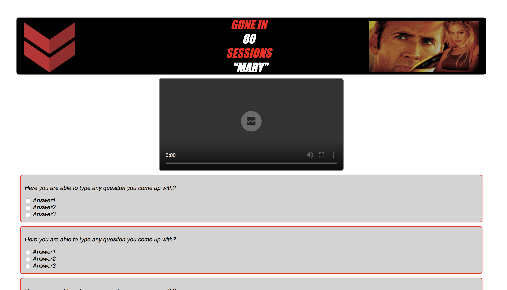

# Blackstone_Quizes

Blackstone Quizes is an internal training tool used to enhance employee knowledge about Blackstone's current retail inventory.

# Check out my progress:

## https://mquade91.github.io/Blackstone_Quizes/views/quiz1.html

## TO DO
Build Home Page\
'Welcome to gone in 60 sessions'\
Dropdown with each quiz in toolbar that
takes user to selected quiz\

## Post MVP enhancements:
Grade output into HTML\
Allow user to email score(send SS?) to Manager or Supervisor\
Incentive to complete?(Mini Game)\
Eventually expand to 'Employee Training Handbook'\
  Easily allows Blackstone to onboard new employees and ensure culture, values, and objectives.\
  Add User Login\
    -Google Auth (current Blackstone emails)\
  -Mobile Responsive\
